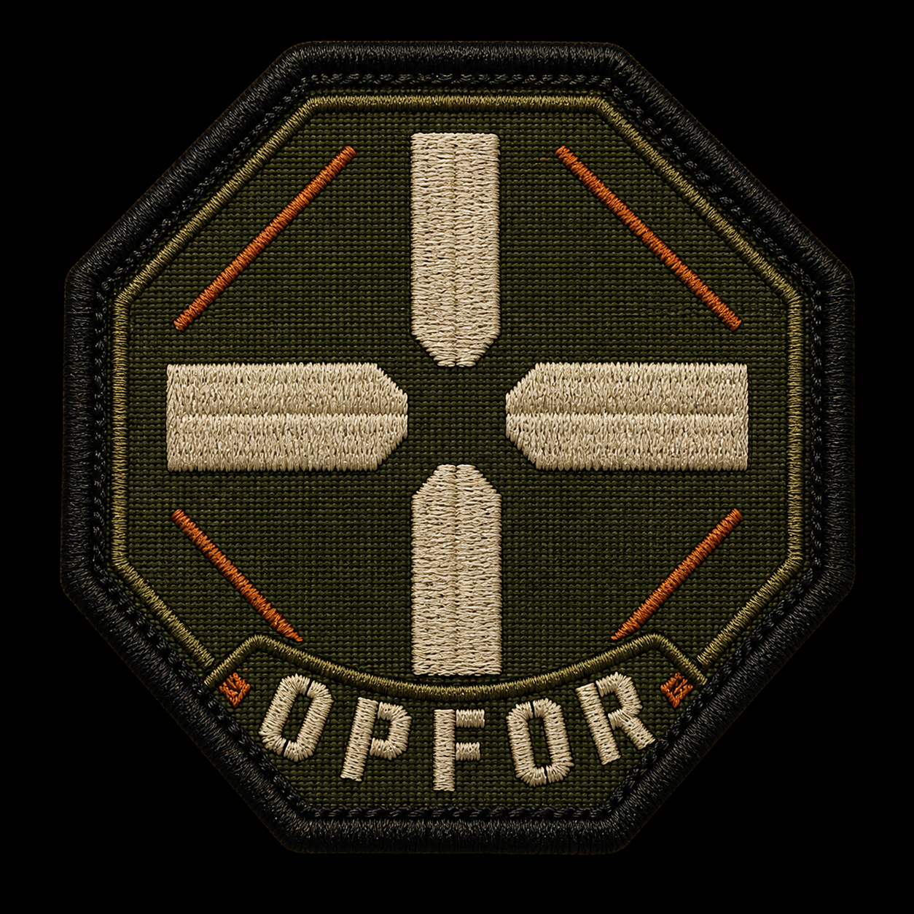

<p align="center">
  
</p>

<h1 align="center">OPFOR</h1>

<p align="center">
  A pure-Go embeddable Sleep and Aggressor Script runtime.
</p>

OPFOR is a pure Go implementation of Sleep and Aggressor Script runtime.


## Embed OPFOR

Requires Go 1.24 or later.

```sh
go get github.com/sliverarmory/opfor
```

Compile a program once, create a runtime, and execute it with optional
arguments:

```go
package main

import (
	"context"
	"log"

	"github.com/sliverarmory/opfor"
)

func main() {
	ctx := context.Background()

	program, err := opfor.CompileString("hello.cna", `
sub greeting {
    return "hello " . $1;
}
println(greeting(@ARGV[0]));
`)
	if err != nil {
		log.Fatal(err)
	}

	runtime, err := opfor.New()
	if err != nil {
		log.Fatal(err)
	}
	defer runtime.Close(ctx)

	if _, err := runtime.Execute(ctx, program, opfor.String("operator")); err != nil {
		log.Fatal(err)
	}
}
```

`println` writes to standard output by default. Use `WithStdin`, `WithStdout`,
and `WithStderr` to replace the process streams.

## Connect Cobalt functionality

OPFOR owns parsing, execution, callbacks, and script lifecycle. The importing
application owns Cobalt-specific effects such as Team Server transport, Beacon
tasking, payload generation, UI, and data stores.

Install only the typed providers your application supports:

```go
provider := opfor.AggressorBeaconActionProviderFunc(func(
	_ context.Context,
	action opfor.AggressorBeaconAction,
) error {
	log.Printf("%s beacon=%s args=%v", action.Name, action.Target, action.Arguments)
	return nil
})

runtime, err := opfor.New(
	opfor.WithAggressorBeaconActionProvider(provider),
)
if err != nil {
	log.Fatal(err)
}
defer runtime.Close(context.Background())
```

`WithFunction` registers an exact native function, while `WithHost` provides a
generic fallback for unresolved Aggressor calls. Unsupported operations return
explicit errors instead of silently pretending that a Team Server action
succeeded.

## CLI

Build the `opfor` interpreter:

```sh
go build -o opfor ./cmd/opfor
```

Then evaluate an expression, validate a script, or run it:

```sh
./opfor eval '2 + 2'
./opfor check example.cna
./opfor run example.cna arg1 arg2
```

Running `./opfor` without arguments prints the complete command help. The CLI
is an offline interpreter; it does not connect or log in to a Cobalt Strike
Team Server.

## Scope

OPFOR implements Sleep and Aggressor Script, not Java. A small pure-Go
compatibility shim covers the Java-shaped string, collection, file, random,
and UUID behavior needed by supported scripts. Other object behavior can be
provided by the embedding application.

Java serialization is optional compatibility support for scripts that
explicitly use it; it is not required for normal embedding, execution, or
callbacks.

See the [detailed compatibility and embedding reference](docs/README.md) for
the provider catalog, lifecycle contracts, limits, conformance kit, and exact
alpha coverage.

## License

Apache License 2.0. See [LICENSE](LICENSE).
